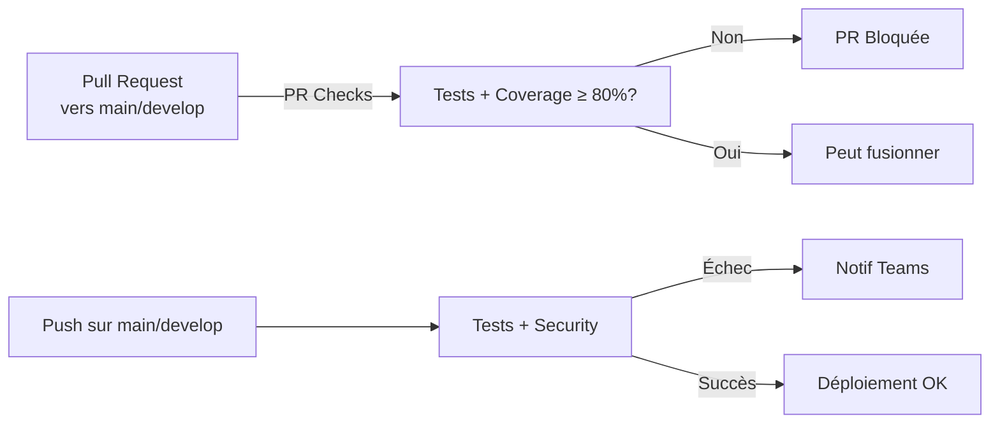

# GitHub Actions CI/CD Configuration

## Workflows

### 1. `tests.yml` - Main Test Pipeline

Exécuté à chaque **push** sur `main` ou `develop` et à chaque **pull request**.

**Vérifie:**
- ✅ Tests unitaires (39 tests)
- ✅ Coverage ≥ 80% (bloquant)
- ✅ Sécurité (Bandit + pip-audit)

**Actions:**
- Télécharge les rapports de coverage (HTML)
- Envoie une notification Teams en cas d'échec

### 2. `pr-checks.yml` - Protection des branches

Exécuté uniquement sur les **pull requests** vers `main` ou `develop`.

**Vérifie:**
- ✅ Les tests passent
- ✅ Coverage ≥ 80% (sinon PR bloquée)
- ✅ Ajoute un commentaire au PR avec le statut

## Configuration Teams

### Pour activer les notifications Teams:

1. Dans **Microsoft Teams**, créer un webhook entrant:
   - Équipe → Paramètres du canal → Connecteurs
   - Ajouter "Incoming Webhook"
   - Copier l'URL

2. Dans **GitHub**, ajouter le secret:
   - Paramètres du repo → Secrets and variables → Actions
   - Ajouter `MS_TEAMS_WEBHOOK_URL` avec l'URL du webhook Teams

## Branchement



## Secrets GitHub à configurer

| Secret | Description | Exemple |
|--------|-------------|---------|
| `MS_TEAMS_WEBHOOK_URL` | URL du webhook Teams | `https://outlook.webhook.office.com/...` |

## Commandes locales équivalentes

```bash
# Tests + Coverage
make test

# Sécurité
make security

# Tout nettoyer
make clean
```
